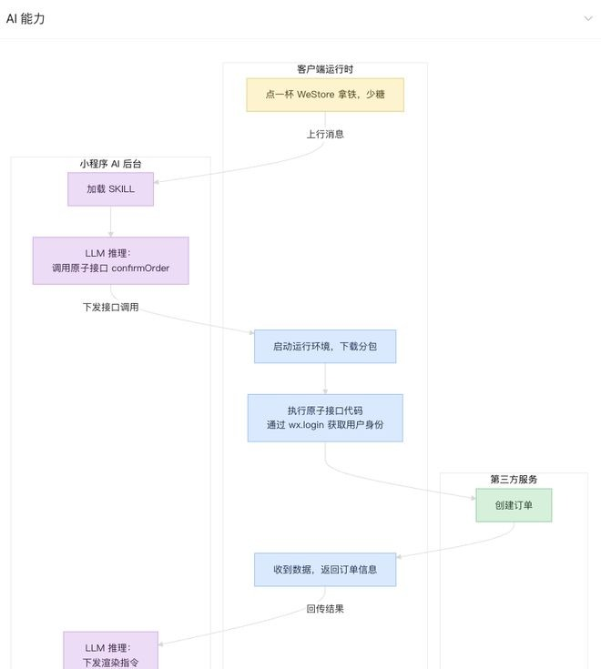

# 背景

## 功能本质

- 微信小程序最近推出小程序 AI 开发，（2026 年 6 月）处于**内测阶段**，需在小程序后台申请开通，暂未开放正式代码提审微信开放社区。
- 首先需要理解功能本质：不是 "在小程序里加 AI 聊天"，而是 "让微信 AI 智能体直接调用你的小程序"。是**流量入口型接入**（用户在微信 AI 对话窗口完成服务），而非业务功能型接入。

## 适用场景与核心价值

众所周知微信在国内的用户体量，做微信小程序AI开发有点像微信版的”SEO“。让微信AI根据你小程序的开发配置，匹配关键词出结果。
随着AI渐渐进入大众视野，为了提升品牌的曝光率，做这方面的AI开发有一定的意义。（适合生活服务的交易类，预约类，查询信息类（快递、票务））。

# 核心架构

根据官方所说，小程序提供了自动模式帮你已有的小程序实现SKILL，但有说法说手动开发模式针对场景，匹配度会更好。下面主要看看是怎么手动实现的。了解一下开发，看看[官方文档](https://developers.weixin.qq.com/miniprogram/dev/ai/guide.html?f_link_type=f_linkinlinenote&flow_extra=eyJpbmxpbmVfZGlzcGxheV9wb3NpdGlvbiI6MCwiZG9jX3Bvc2l0aW9uIjowLCJkb2NfaWQiOiJiM2RjYjQxZDdhMzRkZjU2LTNhZjdjMGIwN2MwNWNjOWYifQ%3D%3D)，核心就在MCP 协议 + SKILL 能力包。

1. 基于**微信专属 MCP 协议**（与标准 MCP 不同，适配小程序生态）
2. 一个小程序最多可创建**30 个独立 SKILL**，每个 SKILL 对应一类完整业务场景

微信客户端与小程序 AI 后台基于小程序 MCP 完成交互，开发者无需理解交互协议细节，只需要按框架设计提供完整的 `SKILL` 实现，小程序 AI 就能正确地推理及执行相应的原子接口。

| 文件 / 目录          | 作用                                     | 权重（AI 读取优先级） |
| ---------------- | -------------------------------------- | ------------ |
| `mcp.json`       | 能力契约：向 AI 声明所有**原子接口**、入参、出参、展示卡片、功能描述 | ★★★★（最高）     |
| `index.js`       | 接口注册入口：导出所有原子接口函数，AI 调用时执行             | 运行时核心        |
| `SKILL.md`       | 业务流程说明书：完整场景执行逻辑、步骤约束、意图匹配关键词、异常处理规则   | ★★★（最低）      |
| `components/` 目录 | 原子组件：对话窗口内渲染的可视化卡片（商品卡、订单确认卡、表单卡）      | 交互展示层        |

了解配置，可以参考官方[示例 demo](https://github.com/wechat-miniprogram/ai-mode-demo)。
## mcp.json

| 属性           | 是否必填 | 说明                                                                                          |
| ------------ | ---- | ------------------------------------------------------------------------------------------- |
| name         | 是    | 标识符，跟 `index.js` 中导出的原子接口函数名一致                                                              |
| description  | 是    | 原子接口的功能描述                                                                                   |
| inputSchema  | 是    | 就是api的入参                                                                                    |
| outputSchema | 建议填  | api约束的 `structuredContent`对应的 schema，就是接口返回的数据结构                                            |
| _meta        | 否    | 可指定渲染的原子组件，`componentPath` 相对于 `SKILL` 目录，如 `{ "ui": { "componentPath": "path/to/comp" } }` |

## 接口
原子接口就是从你的服务接口获取到的数据后，组装成微信要的数据结构

| 属性                | 类型                         | 说明                                     |
| ----------------- | -------------------------- | -------------------------------------- |
| isError           | boolean                    | 默认为 false                              |
| content           | ContentBlock[]             | 返回给 LLM 的文本内容。描述业务接口的结果，可以用统计查询结果。     |
| structuredContent | { [key: string]: unknown } | 返回给 LLM 的结构化数据，对应mcp.json的outputSchema |
| _meta             | { [key: string]: unknown } | 对 LLM 不可见，可携带元数据，可以用于渲染页面所需要的数据。       |

# 运行机制

微信客户端与小程序 AI 后台基于小程序 MCP 完成交互，开发者无需理解交互协议细节，只需要按框架设计提供完整的 `SKILL` 实现，小程序 AI 就能正确地推理及执行相应的原子接口.

# 总结

在计算机领域有一句话，万物都可以通过新增一层来实现。这个微信AI实现感觉就是如此。原有的业务接口都是完善的话，通过自身的服务器api --- 组装成微信要求的数据结构，通过Mcp.json的约束和 SKILL的描述就完成了。

